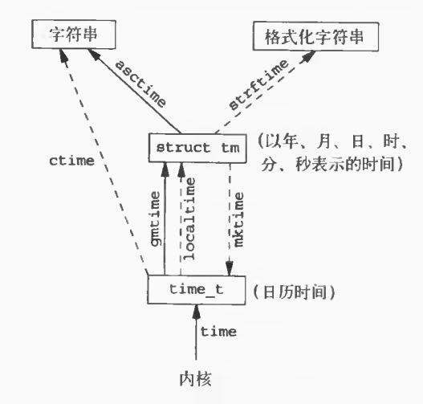

# Advanced Programming in the UNIX Environment—Chapter 06 系统数据文件和信息

## 1. 口令文件

### 1.1 位置

`/etc/passwd`

### 1.2 结构体`passwd`

```C
#include <pwd.h>

struct passwd
{
    char *pw_name;   /* username */
    char *pw_passwd; /* encrypted user password */
    uid_t pw_uid;    /* user ID */
    gid_t pw_gid;    /* group ID */
    char *pw_gecos;  /* user information */
    char *pw_dir;    /* home directory */
    char *pw_shell;  /* shell program */
};
```

### 1.3 `getpwuid`和`getpwnam`函数

#### 1.3.1 功能

获取用户的口令文件项

#### 1.3.2 函数原型

```C
#include <pwd.h>

// 成功返回对应指针，出错返回NULL
struct passwd *getpwuid(uid_t uid);
struct passwd *getpwnam(const char *name);
```

#### 1.3.3 应用

`ls`程序使用`getpwuid`函数

`login`程序使用`getpwnam`函数

### 1.4 `getpwent`、`setpwent`和`endpwent`函数

#### 1.4.1 功能

+ `getpwent`：自动打开密码文件，并按顺序读取各项
+ `setpwent`：将文件指针重置回密码文件的起始处
+ `endpwent`：关闭密码文件

#### 1.4.2 函数原型

```C
#include <pwd.h>

// 成功返回指针，出错或到达文件结尾返回NULL
struct passwd *getpwent(void);

void setpwent(void);
void endpwent(void);
```

#### 1.4.3 实现`getpwnam`函数

```C
#include <pwd.h>
#include <stddef.h>
#include <string.h>

struct passwd *
getpwnam(const char *name)
{
    struct passwd *ptr;

    setpwent();
    while ((ptr = getpwent()) != NULL) // getpwent return value may point to a static area
    {
        if (strcmp(name, ptr->pw_name) == 0)
            break; /* found a match */
    }
    endpwent();
    return ptr; /* ptr is NULL if no match found */
}
```

## 2. 阴影口令

### 2.1 位置

`/etc/shadow`

### 2.2 结构体`spwd`

```C
#include <shadow.h>

struct spwd
{
    char *sp_namp;             /* user login name */
    char *sp_pwdp;             /* encrypted password */
    long int sp_lstchg;        /* time since the last password change */
    long int sp_min;           /* minimum days before allowed change */
    long int sp_max;           /* maximum days before required change */
    long int sp_warn;          /* number of days for password expiration warning */
    long int sp_inact;         /* number of days before the account becomes inactive */
    long int sp_expire;        /* number of days until the account expires */
    unsigned long int sp_flag; /* reserved */
};
```

### 2.3 函数

功能类似1.3、1.4节函数

```C
#include <shadow.h>

// 成功返回指针，出错返回NULL
struct spwd *getspnam(const char *name);
struct spwd *getspent(void);

void setspent(void);
void endspent(void);
```

## 3. 组文件

### 3.1 位置

`/etc/group`

### 3.2 结构体`group`

```C
#include <grp.h>

struct group
{
    char *gr_name;   /* group name */
    char *gr_passwd; /* password */
    int gr_gid;      /* group ID */
    char **gr_mem;   /* list of group members */
};
```

### 3.3 函数

功能类似1.3、1.4节函数

```C
#include <grp.h>

// 成功返回指针，出错返回NULL
struct group *getgrgid(gid_t gid);
struct group *getgrnam(const char *name);

struct group *getgrent(void);
void setgrent(void);
void endgrent(void);
```

## 4. 附加组ID

### 4.1 `initgroups`函数

#### 4.1.1 功能

初始化用户的附加组

#### 4.1.2 函数原型

```C
#include <grp.h>

// 成功返回0，出错返回-1
int initgroups(const char *username, gid_t basegid);
```

### 4.2 `getgroups`函数

#### 4.2.1 功能

获取进程的附加组ID

#### 4.2.2 函数原型

```C
#include <unistd.h>

// 成功返回附加组ID数，出错返回-1
int getgroups(int gidsetsize, gid_t grouplist[]);
```

### 4.3 `setgroups`函数

#### 4.3.1 功能

设置进程的附加组ID

#### 4.3.2 函数原型

```C
#include <grp.h>

// 成功返回0，出错返回-1
int setgroups(int ngroups, const gid_t grouplist[]);
```

## 5. 系统标识

### 5.1 `uname`函数

#### 5.1.1 功能

返回当前主机和操作系统有关的信息

#### 5.1.2 结构体`utsname`

```C
#include <sys/utsname.h>

struct utsname
{
    char sysname[];  /* name of the operating system */
    char nodename[]; /* name of this node */
    char release[];  /* current release of operating system */
    char version[];  /* current version of this release */
    char machine[];  /* name of hardware type */
};
```

#### 5.1.3 函数原型

```C
#include <sys/utsname.h>

// 成功返回非负值，出错返回-1
int uname(struct utsname *name);
```

### 5.2 `gethostname`函数

#### 5.2.1 功能

获取主机名（通常是TCP/IP网络上的主机）

#### 5.2.2 函数原型

```C
#include <unistd.h>

// 成功返回0，出错返回-1
int gethostname(char *name, int namelen);
```

## 6. 时间和日期例程

### 6.1 与时间有关的类型

#### 6.1.1 `time_t`

`time_t`表示自1970年1月1日以来的秒数

#### 6.1.2 结构体`timeval`

```C
#include <sys/time.h>

struct timeval
{
    long tv_sec;  /* seconds */
    long tv_usec; /* microseconds */
};
```

#### 6.1.3 结构体`timezone`

```C
#include <sys/time.h>

struct timezone
{
    int tz_minuteswest; /* of Greenwich */
    int tz_dsttime;     /* type of dst correction to apply */
};
```

#### 6.1.4 结构体`tm`

```C
#include <time.h>

struct tm
{
    int tm_sec;   /* seconds after the minute: [0-60] */
    int tm_min;   /* minutes after the hour: [0-59] */
    int tm_hour;  /* hours after the midnight: [0-23] */
    int tm_mday;  /* day of the month: [1-31] */
    int tm_mon;   /* months since January: [0-11] */
    int tm_year;  /* years since 1900 */
    int tm_wday;  /* days since Sunday: [0-6] */
    int tm_yday;  /* days since January 1: [0-365] */
    int tm_isdst; /* daylight saving time flag */
};
```

### 6.2 时间获取

#### 6.2.1 `time`函数

获取自1970年1月1日以来的秒数

```C
#include <time.h>

// 成功返回时间值，出错返回-1
time_t time(time_t *calptr);
```

#### 6.2.2 `gettimeofday`

获取当前精确时间（微秒级）

```C
#include <sys/time.h>

// 总是返回0
int gettimeofday(struct timeval *tv, struct timezone *tz);
```

### 6.3 时间转换

#### 6.3.1 `gmtime`和`localtime`函数

+ `gmtime`：将日历时间转换为国际标准时间
+ `localtime`：将日历时间转换为本地时间

```C
#include <time.h>

// 返回指向结构体tm的指针
struct tm *gmtime(const time_t *calptr);
struct tm *localtime(const time_t *calptr);
```

#### 6.3.2 `mktime`函数

`struct tm`转换为`time_t`

```C
#include <time.h>

// 成功返回日历时间，出错返回-1
time_t mktime(struct tm *tmptr);
```

#### 6.3.3 `asctime`和`ctime`函数

将日期表示转换为26字节的字符串形式，例如：`Tue Feb 10 18:27:38 2004\n\0`

```C
#include <time.h>

// 返回以null结尾的字符串的指针
char *asctime(const struct tm *timeptr);
char *ctime(const time_t *time);
```

#### 6.3.4 `strftime`函数

根据指定的格式将`struct tm`类型的时间信息转换为一个字符串

```C
#include <time.h>

// 若有空间则返回存入数组的字符数，否则返回0
size_t strftime(char *str, size_t maxsize, const char *format, const struct tm *timeptr);
```

### 6.4 时间函数之间的关系




