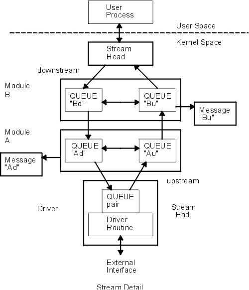
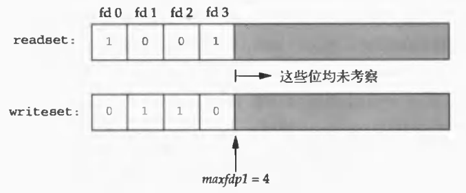
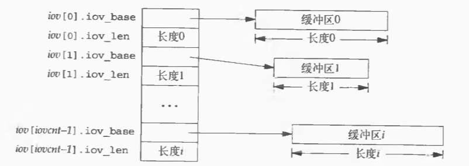
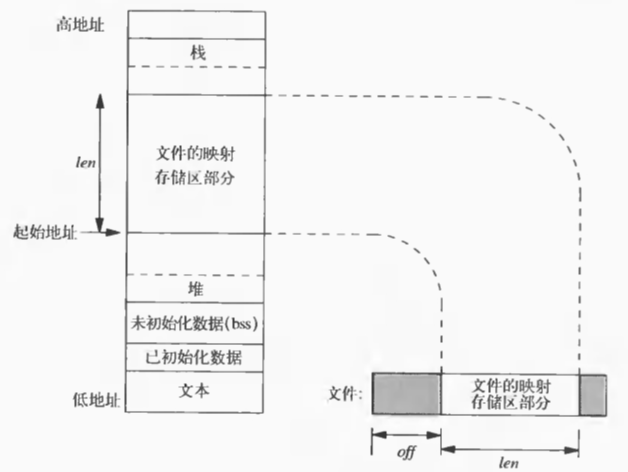

# Advanced Programming in the UNIX Environment—Chapter 14 高级I/O

## 1. 非阻塞I/O

### 1.1 阻塞I/O与非阻塞I/O

+ 阻塞I/O：数据未就绪时，进程等待

+ 非阻塞I/O：数据未就绪时，进程继续执行

### 1.2 低速系统调用

+ 对于某些文件类型（如管道、终端设备和网络设备），如果数据不存在，读操作会导致调用者阻塞
+ 如果数据无法写入文件（如管道无空间、网络流控制等），写操作会导致调用者阻塞
+ 打开某些类型的文件可能会导致阻塞
+ 对已加强制性记录锁的文件进行读写
+ 执行某些`ioctl`操作
+ 使用某些进程间通信函数

### 1.3 设置非阻塞I/O

+ 使用`open`函数和`O_NONBLOCK`标志打开新文件
+ 对已打开的文件，用`fcntl`函数启用`O_NONBLOCK`标志

## 2. 记录锁

### 2.1 功能

当一个进程正在读取或修改文件的某个部分时，记录锁能阻止其他进程对同一文件区域进行修改

### 2.2 结构体`flock`

```C
#include <fcntl.h>

struct flock
{
    short l_type;
    short l_whence;
    off_t l_start;
    off_t l_len;
    pid_t l_pid;
};
```

#### 2.2.1 成员`l_type`

锁类型

+ `F_RDLCK` ：读锁（共享）
+ `F_WRLCK`：写锁（独占）
+ `F_UNLCK`：解锁

#### 2.2.2 成员`l_whence`

锁的起始位置

+ `SEEK_SET` ：文件开头
+ `SEEK_CUR`：当前位置
+ `SEEK_END`：文件末尾

#### 2.2.3 成员`l_start`

锁的起始偏移量，相对于 `l_whence` 而言

#### 2.2.4 成员`l_len`

锁定的字节数

#### 2.2.5 成员`l_pid`

仅在`fcntl`函数执行`F_GETLK`操作时使用，表示拥有锁的进程ID

### 2.3 `fcntl`函数

#### 2.3.1 函数原型

```C
#include <fcntl.h>

// 失败返回-1，并设置errno
// 成功调用，其返回值与操作命令有关
int fcntl(int fd, int cmd, ... /* optional argument */);
```

#### 2.3.2 参数`cmd`

+ `F_DUPFD`：复制文件描述符

+ `F_GETFD`和`F_SETFD`：获取/设置文件描述符标志*（现在只有一个`FD_CLOEXEC`）*

+ `F_GETFL`和`F_SETFL`：获取/设置文件状态标志

| 文件状态标志 |           说明           |
| :----------: | :----------------------: |
|  `O_RDONLY`  |           只读           |
|  `O_WRONLY`  |           只写           |
|   `O_RDWR`   |           读写           |
|  `O_APPEND`  |          追加写          |
| `O_NONBLOCK` |          非阻塞          |
|   `O_SYNC`   | 等待写完成（数据和属性） |
|  `O_DSYNC`   |   等待写完成（仅数据）   |
|  `O_RSYNC`   |         同步读写         |


+ `F_GETLK`和`F_SETLK`：获取/设置文件锁
+ `F_SETLKW`：设置文件锁并等待
+ `F_GETOWN`和`F_SETOWN`：获取/设置接收`SIGIO`和`SIGURG`信号的进程ID或进程组ID

### 2.4 锁的隐含继承与释放

+ 进程终止时释放所建立的全部锁
+ 关闭一个文件描述符时，该进程通过此描述符所引用的文件上的所有的锁都会被释放


+ 子进程**不继承**父进程的锁*（若可以继承，则违背了锁的原则）*
+ 在`exec`后，新程序可以继承原进程的锁，但关闭带有`close-on-exec`标志的文件描述符会释放所有锁

### 2.5 文件尾端加锁

注意：

+ 当`l_len`为0时，锁的范围将扩展到最大偏移量。这意味着无论向文件中追加多少数据，这些数据都会被锁定
+ 在解锁时，`SEEK_END`的位置可能已经发生变化

### 2.6 建议性锁和强制性锁

+ 建议性锁：进程主动检查并尊重锁，但不强制
+ 强制性锁：内核执行锁，阻止违规访问

## 3. STREAMS

### 3.1 概念[^1]

> + 流：内核空间中的驱动程序与用户空间中的进程之间的**全双工**处理和数据传输路径
> + STREAMS：用于开发系统通信服务的设施和工具集，允许创建、使用和拆解流

### 3.2 组成[^1]

> | 组件 |                             描述                             |
> | :--: | :----------------------------------------------------------: |
> | 流首 | 提供流和用户进程之间的接口。它的主要功能是处理STREAMS相关的用户系统调用 |
> | 模块 |       处理在流首和驱动程序之间传输的数据。模块是可选的       |
> | 流尾 | 提供外部输入/输出设备或内部软件驱动程序的服务。内部软件驱动程序通常称为伪设备驱动程序 |

> 

### 3.3 STREAMS消息

STREAMS的所有输入和输出都基于消息

#### 3.3.1 消息组成—类型

`read`、`write`、`getmsg`、`getpmsg`、`putmsg`、`putpmsg`中只涉及到三种消息类型：

+ `M_DATA`：I/O用户数据
+ `M_PROTO`：协议控制信息
+ `M_PCPROTO`：高优先级协议控制信息

#### 3.3.2 消息组成—控制信息和数据*（可选）*

由`strbuf`结构指定

```C
struct strbuf {
    int maxlen;
    int len;
    char* buf;
};
```

+ `maxlen`表示缓冲区长度*（以字节为单位）*，`len`为数据量
+ `len`可以为0，如果为-1则表示没有控制信息或数据

#### 3.3.3 消息优先级

流中的消息的排队优先级

+ 高优先级消息*（最高优先级）*
+ 优先级波段消息*（波段为1-255，波段愈高，优先级愈高）*
+ 普通消息*（波段为0，最低优先级）*

### 3.4 `putmsg`和`putpmsg`函数[^2]

#### 3.4.1 功能

将STREAMS消息写至流中

#### 3.4.2 函数原型

```C
#include <stropts.h>

// 成功返回0，出错返回-1
int putmsg(int fd, const struct strbuf *ctlptr, const struct strbuf *dataptr, int flag);
int putpmsg(int fd, const struct strbuf *ctlptr, const struct strbuf *dataptr, int band, int flag);
```

#### 3.4.3 注意

对流也可以使用`write`函数，等价于不带控制信息、`flag`为0的`putmsg`函数

### 3.5 STREAMS`ioctl`操作

```C
#include <sys/ioctl.h>

// 出错返回-1，成功返回其他值
int ioctl(int fd, int request, ...);
```

### 3.6 写模式

使用`ioctl`函数获得和设置一个流的写模式。如同处理文件描述符标志和文件状态标志，应当先获得当前写模式值，然后再修改

#### 3.6.1 获得写模式

+ 参数`request`为`I_GWROPT`
+ 第三个参数：指向整型变量的指针

#### 3.6.2 设置写模式

+ 参数`request`为`I_SWROPT`

+ 第三个参数：整型值

    + `SNDZERO`：对管道和FIFO的零长度写会发送零长度消息*（默认零长度写不发送消息）*

    - `SNDPIPE`：流错误后，`write`或`putmsg`调用会触发`SIGPIPE`信号

### 3.7 `getmsg`和`getpmsg`函数

#### 3.7.1 功能

从流首读STREAMS消息

#### 3.7.2 函数原型

```C
#include <stropts.h>

// 成功返回非负值，出错返回-1
int getmsg(int fd, struct strbuf *restrict ctlptr, struct strbuf *restrict dataptr, int *restrict flagptr);
int getpmsg(int fd, struct strbuf *restrict ctlptr, struct strbuf *restrict dataptr, int *restrict bandptr,
            int *restrict flagptr);
```

### 3.8 读模式

使用`ioctl`函数获得和设置一个流的读模式。如同处理文件描述符标志和文件状态标志，应当先获得当前读模式值，然后再修改

#### 3.8.1 获得读模式

+ 参数`request`为`I_GRDOPT`
+ 第三个参数：指向整型变量的指针

#### 3.8.2 设置读模式

+ 参数`request`为`I_SRDOPT`
+ 第三个参数：整型值*（只能设置一种消息读模式和一种协议读模式，默认读模式是`RNORM | RPROTNORM`）*
    + 消息读模式
        + `RNORM`：普通，字节流模式
        + `RMSGN`：消息不丢弃模式
        + `RMSGD`：消息丢弃模式
    + 协议读模式
        + `RPROTNORM`：协议-普通模式
        + `RPROTDAT`：协议-数据模式
        + `RPROTDIS`：协议-丢弃模式

## 4. I/O多路转接

I/O多路转接允许单个进程同时监视多个I/O通道，提高并发性和效率

### 4.1 `select`函数

#### 4.1.1 功能

`select`函数监控多个文件描述符，检查其I/O状态，可设定超时

#### 4.1.2 `fd_set`类型[^3]

> ```C
> #include <sys/select.h>
> 
> // 简化版本
> // 源码在/usr/include/sys/select.h下
> typedef struct
> {
>     long int fds_bits[32];
> } fd_set;
> ```

操作

```C
#include <sys/select.h>

FD_ZERO(fd_set *set);          // 将set清零使集合中不含任何fd
FD_SET(int fd, fd_set *set);   // 将fd加入set集合
FD_CLR(int fd, fd_set *set);   // 将fd从set集合中清除
FD_ISSET(int fd, fd_set *set); // 检测fd是否在set集合中，不在则返回0
```

操作示例

```C
fd_set rset;
int fd;

FD_ZERO(&rset);
FD_SET(fd, &rset);
FD_SET(STDIN_FILENO, &rset);

// 从select返回后，判断其是否仍在集合中
if (FD_ISSET(fd, &rset))
{
    ...
}
```

#### 4.1.3 结构体`timeval`

> ```C
> #include <sys/time.h>
> 
> struct timeval
> {
>        long tv_sec;  /* seconds */
>        long tv_usec; /* microseconds */
> };
> ```

#### 4.1.4 函数原型

```C
#include <sys/select.h>

// 返回准备就绪的描述符数，超时返回0，出错返回-1
int select(int maxfdp1, fd_set *restrict readfds, fd_set *restrict writefds, fd_set *restrict exceptfds,
           struct timeval *restrict tvptr);
```

#### 4.1.5 参数

+  `maxfdp1`：在三个描述符集中找出最大描述符编号值，然后加1

```C
fd_set readset writeset;

FD_ZERO(&readset);
FD_ZERO(&writeset);
FD_SET(0, &readset);
FD_SET(3, &readset);
FD_SET(1, &writeset);
FD_SET(2, &writeset);

select(4, &readset, &writeset, NULL, NULL);
```



+  参数`readfds`：读集
+  参数`writefds`：写集
+  参数`exceptfds`：异常状态集
+  参数`tvptr`：指定等待时间，有三种情况
    + `tvptr == NULL`：一直等待，直到至少有一个文件描述符准备好
    + `tvptr->tv_sec == 0 && tvptr->tv_usec == 0`：完全不等待，测试完所有描述符并立即返回
    + `tvptr->tv_sec != 0 || tvptr->tv_usec != 0`：等待指定的秒数和微妙数。当某一描述符准备好或者超时，立即返回

#### 4.1.6 注意

+ 文件描述符的阻塞状态与`select`函数是否阻塞无关

+ 当文件描述符读取到文件结尾时，`select`函数会将其视为可读状态，而非异常状态

### 4.2 `pselect`函数

#### 4.2.1 功能

监视多个文件描述符，支持纳秒级超时和信号掩码设置

#### 4.2.2 结构体`timespec`

> ```C
> #include <time.h>
> 
> struct timespec
> {
>        time_t tv_sec; /* Seconds */
>        long tv_nsec;  /* Nanoseconds */
> };
> ```

#### 4.2.3 函数原型

```C
#include <sys/select.h>

// 返回准备就绪的描述符数，超时返回0，出错返回-1
int pselect(int maxfdp1, fd_set *restrict readfds, fd_set *restrict writefds, fd_set *restrict exceptfds,
            const struct timespec *restrict tsptr, const sigset_t *restrict sigmask);
```

#### 4.2.4 `sigset_t`类型及操作

```C
/* /usr/include/signal.h */
typedef __sigset_t sigset_t;

/* /usr/include/bits/sigset.h */
typedef struct
{
    unsigned long int __val[_SIGSET_NWORDS];
} __sigset_t;
```

```C
#include <signal.h>

// 初始化由set指定的信号集，信号集里面的所有信号被清空
int sigemptyset(sigset_t *set);

// 调用该函数后，set指向的信号集中将包含linux支持的64种信号
int sigfillset(sigset_t *set);

// 在set指向的信号集中加入signum信号
int sigaddset(sigset_t *set, int signum);

// 在set指向的信号集中删除signum信号
int sigdelset(sigset_t *set, int signum);

// 判定信号signum是否在set指向的信号集中
int sigismember(const sigset_t *set, int signum);
```

#### 4.2.5 参数`sigmask`

`sigmask`参数在`pselect`函数中用于在调用`pselect`期间原子性地阻塞某些信号

+ 如果`sigmask`为空，那么在处理信号方面，`pselect`和`select`的行为是相同的
+ 如果`sigmask`不为空，那么在调用`pselect`时，会以原子操作的方式应用这个信号掩码，并在返回时恢复之前的信号掩码

#### 4.2.6 注意

`pselect`不会修改时间参数

### 4.3 `poll`函数

#### 4.3.1 功能

功能类似于`select`函数，监视文件描述符状态变化

#### 4.3.2 结构体`pollfd`

```C
#include <poll.h>

struct pollfd
{
    int fd;        /* file descriptor to check, or <0 to ignore */
    short events;  /* events of interest on fd */
    short revents; /* events that occurred on fd */
};
```

#### 4.3.3 `events`和`revents`[^4]

| 事件 |      值      | 是否可作为`events` | 是否可作为`revents` |                             说明                             |
| :--: | :----------: | :----------------: | :-----------------: | :----------------------------------------------------------: |
|  读  |   `POLLIN`   |      &#10004;      |      &#10004;       | 不阻塞地可读除高优先级外的数据（等价于`POLLRDNORM | POLLRDBAND`） |
|  读  | `POLLRDNORM` |      &#10004;      |      &#10004;       |            不阻塞地可读普通数据（优先级波段为0）             |
|  读  | `POLLRDBAND` |      &#10004;      |      &#10004;       |                不阻塞地可读非0优先级波段数据                 |
|  读  |  `POLLPRI`   |      &#10004;      |      &#10004;       |                   不阻塞地可读高优先级数据                   |
|  写  |  `POLLOUT`   |      &#10004;      |      &#10004;       |                     不阻塞地可写普通数据                     |
|  写  | `POLLWRNORM` |      &#10004;      |      &#10004;       |                       与`POLLOUT`相同                        |
|  写  | `POLLWRBAND` |      &#10004;      |      &#10004;       |                不阻塞地可写非0优先级波段数据                 |
| 异常 |  `POLLERR`   |      &#10006;      |      &#10004;       |                            已出错                            |
| 异常 |  `POLLHUP`   |      &#10006;      |      &#10004;       |                            已挂起                            |
| 异常 |  `POLLNVAL`  |      &#10006;      |      &#10004;       |                     描述符不引用打开文件                     |

#### 4.3.4 函数原型

```C
#include <poll.h>

// 返回准备就绪的描述符数，超时返回0，出错返回-1
int poll(struct pollfd fdarray[], nfds_t nfds, int timeout);
```

#### 4.3.5 参数`nfds`

`fdarray`长度

#### 4.3.6 参数`timeout`

| `timeout`值 |               含义               |
| :---------: | :------------------------------: |
|     -1      |             永远等待             |
|      0      | 不等待，测试所有描述符后立即返回 |
|    正数     |        等待`timeout`毫秒         |

## 5. `readv`和`writev`函数

### 5.1 功能

`readv`实现分散读，`writev`实现集中写，提高IO效率*（v代表vector）*

### 5.2 结构体`iovec`

```C
#include <sys/uio.h>

struct iovec
{
    void *iov_base; /* starting address of buffer */
    size_t iov_len; /* size of buffer */
};
```

### 5.3 函数原型

```C
#include <sys/uio.h>

// 成功返回已读写的字符数，出错返回-1
ssize_t readv(int fd, const struct iovec *iov, int iovcnt);
ssize_t writev(int fd, const struct iovec *iov, int iovcnt);
```

### 5.4 `readv`和`writev`的`iovec`结构



## 6. 存储映射I/O

### 6.1 概念

将磁盘文件与缓冲区关联，使得读缓冲区等同于读文件，写缓冲区等同于写文件

### 6.2 `mmap`函数

#### 6.2.1 功能

将文件映射到内存

#### 6.2.2 函数原型

```C
#include <sys/mman.h>

// 成功返回映射区的起始地址，出错返回MAP_FAILED
void *mmap(void *addr, size_t len, int prot, int flag, int fd, off_t off);
```

#### 6.2.3 参数

+ `addr`：映射区的起始地址。通常设置为0，表示由系统选择
+ `len`：映射区长度
+ `prot`：映射区保护模式。它可以设为`PROT_NONE`，或者是`PROT_READ`、`PROT_WRITE`、`PROT_EXEC`任一组合的按位或。映射区的保护级别不能超过文件的打开权限。例如，如果文件是只读的，那么映射区就不能设为`PROT_WRITE`

|    `prot`    |      说明      |
| :----------: | :------------: |
| `PROT_READ`  |   映射区可读   |
| `PROT_WRITE` |   映射区可写   |
| `PROT_EXEC`  |  映射区可执行  |
| `PROT_NONE`  | 映射区不可访问 |

+ `flag`：映射标志

|    `flag`     |                             说明                             |
| :-----------: | :----------------------------------------------------------: |
|  `MAP_FIXED`  |  返回值必须等于`addr`*（不鼓励使用，因为其可移植性比较差）*  |
| `MAP_SHARED`  | 多个进程可共享映射，对映射的更改在不同进程间可见，且更改写回原文件 |
| `MAP_PRIVATE` |        对映射区的修改不会写回原文件，对其他进程不可见        |

+ `fd`：待映射的文件描述符
+ `off`：待映射的文件偏移量



### 6.3 `mprotect`函数

#### 6.3.1 功能

更改映射区权限

#### 6.3.2 函数原型

```C
#include <sys/mman.h>

// 成功返回0，出错返回-1
int mprotect(void *addr, size_t len, int prot);
```

#### 6.3.3 参数`prot`

同`mmap`函数参数`prot`

### 6.4 `msync`函数

#### 6.4.1 功能

将映射区域的修改同步到对应的文件中

#### 6.4.2 函数原型

```C
#include <sys/mman.h>

// 成功返回0，出错返回-1
int msync(void *addr, size_t len, int flags);
```

#### 6.4.3 参数`flags`

+ `MS_ASYNC`：异步写入
+ `MS_SYNC`：同步写入*（一直等待将数据同步写入磁盘）*
+ `MS_INVALIDATE`：使内存区域无效

### 6.5 `munmap`函数

#### 6.5.1 功能

解除映射

#### 6.5.2 函数原型

```C
#include <sys/mman.h>

// 成功返回0，出错返回-1
int munmap(caddr_t addr, size_t len);
```

#### 6.5.3 注意

+ 关闭文件描述符不解除映射区
+ 进程终止也会解除映射区

## References

[^1]: https://www.ibm.com/docs/zh/aix/7.3?topic=streams-introduction
[^2]: https://www.ibm.com/docs/zh/zos/2.2.0?topic=lf-getmsg-getpmsg-receive-next-message-from-streams-file
[^3]: https://blog.csdn.net/Zorro721/article/details/107565000

[^4]: https://blog.csdn.net/skypeng57/article/details/82743681