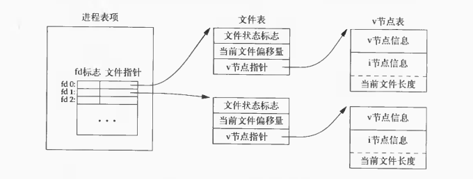
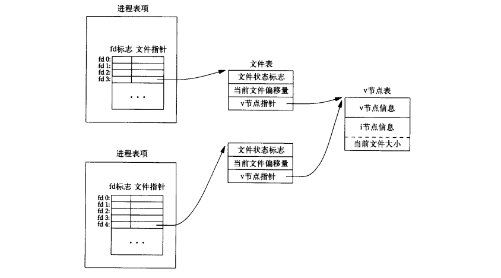

# Advanced Programming in the UNIX Environment—Chapter 3 文件I/O

## 1. 文件描述符

### 1.1 类型

非负整数

### 1.2 功能

文件描述符在内核中用于引用所有打开的文件

### 1.3 惯例

|      常量       |  值  |     含义     |
| :-------------: | :--: | :----------: |
| `STDIN_FILENO`  |  0   |   标准输入   |
| `STDOUT_FILENO` |  1   |   标准输出   |
| `STDERR_FILENO` |  2   | 标准错误输出 |

*注意：常量`STDIN_FILENO` `STDOUT_FILENO` `STDERR_FILENO`定义在头文件`<unistd.h>`中*

## 2. `open`函数

### 2.1 功能

打开或创建一个文件

### 2.2 函数原型

```C
#include <fcntl.h>

// 成功返回文件描述符，出错返回-1
int open(const char *pathname, int oflag, ... /* mode_t mode */);
```

### 2.3 参数`oflag`

#### 2.3.1 必选且唯一指定

+ `O_RDONLY`：只读打开
+ `O_WRONLY`：只写打开
+ `O_RDWR`：读写打开

#### 2.3.2 可选

+ `O_APPEND`：追加写
+ `O_CREAT`：若文件不存在，则创建
+ `O_EXCL`：若同时指定了`O_CREAT`，文件存在则出错，文件不存在则创建
+ `O_TRUNC`：如果文件已存在，则截断文件的长度为零
+ `O_NOCTTY`：如果`pathname`是终端设备，则不将此设备分配为此进程的控制终端
+ `O_NONBLOCK`：非阻塞

#### 2.3.3 其他

+ `O_SYNC`：等待写完成（数据和属性）
+ `O_DSYNC`：等待写完成（仅数据）
+ `O_RSYNC`：同步读写
+ ……

### 2.4 参数`mode`

只有参数`oflag`为`O_CREAT`时才可设置此参数

#### 2.4.1 作用

该参数用于设置文件访问权限的初始值，和用户掩码`umask`有关

#### 2.4.2 参数形式

+ 八进制数：如0777（rwxrwxrwx）
+ 预定义宏的位操作：如`S_IRUSR | S_IWUSR | S_IRGRP | S_IWGRP | S_IROTH`（rw-rw-r--）

### 2.5 文件名和路径名截断

## 3. `creat`函数

### 3.1 功能

创建文件

### 3.2 函数原型

```C
#include <fcntl.h>

// 成功返回为只写打开的文件描述符，出错返回-1
int creat(const char *pathname, mode_t mode);
```

### 3.3 等价形式

```C
open(pathname, O_WRONLY | O_CREAT | O_TRUNC, mode);
```

### 3.4 不足之处

**只写打开**所创建的文件

## 4. `close`函数

### 4.1 功能

关闭打开的文件

### 4.2 函数原型

```C
#include <unistd.h>

// 成功返回0，出错返回-1
int close(int fd);
```

## 5. `lseek`函数

### 5.1 功能

设置文件读写指针的位置

### 5.2 函数原型

```C
#include <unistd.h>

// 成功返回新的文件偏移量，出错返回-1
off_t lseek(int fd, off_t offset, int whence);
```

### 5.3 参数`whence`

+ `SEEK_SET`：文件开头
+ `SEEK_CUR`：当前位置
+ `SEEK_END`：文件末尾

## 6. `read`函数

### 6.1 功能

从打开文件中读数据

### 6.2 函数原型

```C
#include <unistd.h>

// 成功返回读到的字节数，到文件结尾返回0，出错返回-1
ssize_t read(int fd, void *buf, size_t nbytes);
```

## 7. `write`函数

### 7.1 功能

向打开的文件写数据

### 7.2 函数原型

```C
#include <unistd.h>

// 成功返回已写的字节数，出错返回-1
ssize_t write(int fd, const void *buf, size_t nbytes);
```

## 8. 文件共享

### 8.1 数据结构

#### 8.1.1 进程表

+ 位置：内核空间

#### 8.1.2 打开文件描述符表

+ 位置：进程表项*（不一定在进程表中）*
+ 文件描述符表项包含
    + 文件描述符标志*（如`FD_CLOEXEC`）*
    + 文件表项指针

#### 8.1.3 文件表

+ **内核**为所有**打开文件**维护**一张文件表**
+ 文件表项包含
    + 文件状态标志（读、写、追加写、同步、阻塞等）
    + 文件偏移量
    + 指向v节点表项的指针

#### 8.1.4 v节点表

+ V节点包含
    + 文件类型
    + 各种操作的函数指针
    + i节点
+ i节点包含
    + 所有者
    + 文件长度
    + 文件所在设备
    + 指向文件实际数据块在磁盘上所在位置的指针
    + ……



### 8.2 两独立进程打开同一文件

两进程获得**不同的文件描述符**，但指向相同的v节点表项，因为这样能确保每个进程都有自己的对该文件的当前偏移量



## 9. 原子操作

### 9.1 函数原型

```C
#include <unistd.h>

// 成功返回读到的字节数，读到文件结尾返回0；出错返回-1
ssize_t pread(int fd, void *buf, size_t nbytes, off_t offset);
// 成功返回已写的字节数，出错返回-1
ssize_t pwrite(int fd, const void *buf, size_t nbytes, off_t offset);
```

### 9.2 特点

`pread`相当于顺序调用`lseek`和`read`，但是`pread`不可被中断，且**不更新文件指针**

`pwrite`同理

## 10. `dup`和`dup2`函数

### 10.1 功能

复制**现存**的文件描述符

### 10.2 函数原型

```C
#include <unistd.h>

// 成功返回新的文件描述符，出错返回-1
int dup(int fd);
int dup2(int fd, int fd2);
```

### 10.3 返回值

+ `dup`返回文件描述符一定是**可用文件描述符的最小值**
+ `dup2`可用`fd2`指定新描述符。如果`fd2`已经打开，则先将其关闭；如果`fd == fd2`，则`dup2`返回`fd2`，不关闭

### 10.4 `dup2`的原子性

`dup2`函数等价如下：

```C
close(fd2);
fcntl(fd, F_DUPFD, fd2);
```

但`dup2`是原子操作，不会被中断

## 11. `sync` `fsync`和`fdatasync`函数

### 11.1 背景

延迟写策略*（减少磁盘读写次数，降低了文件内容的更新速度）*

### 11.2 函数原型

```C
#include <unistd.h>

// 成功返回0，出错返回-1
int fsync(int fd);
int fdatasync(int fd);

void sync(void);
```

### 11.3 效果

+ `sync`函数将修改过的缓冲区排入写队列，然后返回，并不等待实际写操作结束。*守护进程`update`和命令`sync`也调用`sync`函数*
+ `fsync`函数只对`fd`指定的单一文件起作用，并且等待磁盘写操作结束。*除数据外，`fsync`还会更新文件的属性*
+ `fdatasync`只影响文件的数据部分

## 12. `fcntl`函数

### 12.1 函数原型

```C
#include <fcntl.h>

// 成功返回值依赖于cmd，
// 出错均返回-1
int fcntl(int fd, int cmd, ... /* int arg */);
```

### 12.2 功能（即参数`cmd`）

+ `F_DUPFD`
    + 复制文件描述符
    + 返回值：新文件描述符
+ `F_GETFD`：获取文件描述符标志
+ `F_SETFD`：设置文件描述符标志
+ `F_GETFL`：获取文件状态标志*（即`open`函数的`oflag`）*
+ `F_SETFL`：根据参数`arg`设置文件描述符标志

+ `F_GETOWN`：获取接收`SIGIO`和`SIGURG`信号的进程ID或进程组ID
+ `F_SETOWN`
    + 根据`arg`设置接收`SIGIO`和`SIGURG`信号的进程ID或进程组ID
    + `arg > 0`时指定进程ID
    + `arg < 0`时指定进程组ID（进程组ID为`arg`的绝对值）
+ `F_GETLK`、`F_SETLK`或`F_SETLKW`：获得/设置记录锁

|      概念      |                       含义                       |
| :------------: | :----------------------------------------------: |
| 文件描述符标志 | 体现文件描述符的状态，目前只有一种：`FD_CLOEXEC` |
|  文件状态标志  |           体现进程打开的文件的一些标志           |

### 12.3 实例：修改文件状态标志

**若需要修改文件状态标志，先需要取得现有标志，然后根据需要进行修改，最后设置新标志。不能只是执行`F_SETFD`或`F_SETFL`命令，这样可能会关闭以前设置的标志位**

```C
#include <fcntl.h>
#include <stdio.h>
#include <stdlib.h>

void set_fl(int fd, int flags) // flags are file status flags to turn on
{
    int val;

    if ((val = fcntl(fd, F_GETFL, 0)) < 0)
    {
        fprintf(stderr, "fcntl F_GETFL error");
        exit(1);
    }

    val |= flags; // turn on flags

    if (fnctl(fd, F_SETFL, val) < 0)
    {
        fprintf(stderr, "fcntl F_SETFL error");
        exit(1);
    }
}

void clr_fl(int fd, int flags) // flags are file status flags to turn off
{
    int val;

    if ((val = fcntl(fd, F_GETFL, 0)) < 0)
    {
        fprintf(stderr, "fcntl F_GETFL error");
        exit(1);
    }

    val &= ~flags; // turn flags off

    if (fnctl(fd, F_SETFL, val) < 0)
    {
        fprintf(stderr, "fcntl F_SETFL error");
        exit(1);
    }
}
```

## 13. `ioctl`函数

### 13.1 功能

提供一系列I/O操作

### 13.2 函数原型

```C
#include <unistd.h>    /* System V */
#include <sys/ioctl.h> /* BSD and Linux */
#include <stropts.h>   /* XSI STREAMS */

// 出错返回-1，成功返回其他值
int ioctl(int fd, int request, ...);
```

### 13.3 头文件

不同设备可能需要自己的专用头文件，如终端I/O的`ioctl`命令都需要头文件`<termios.h>`

## 14. `/dev/fd`

打开文件`/dev/fd/n`等效于复制描述符`n`（假定文件描述符`n`是打开的）

```C
fd = open("/dev/fd/0", mode);
```

某些系统还提供路径名`/dev/stdin`、`/dev/stdout` 和`/dev/stderr`

