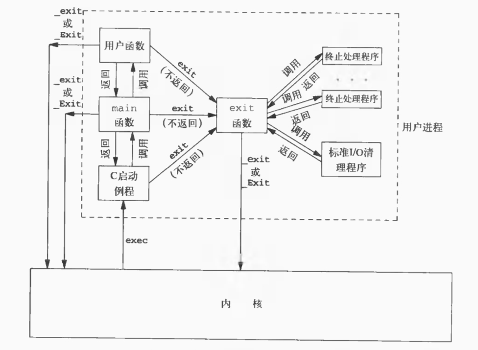
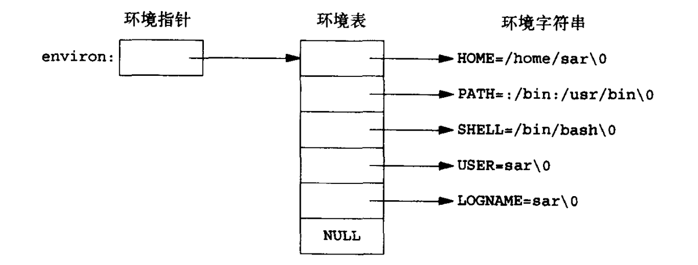
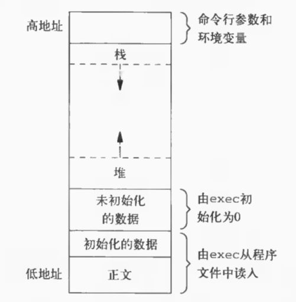

# Advanced Programming in the UNIX Environment—Chapter 7  进程环境

## 1. 进程终止

### 1.1 进程终止方式

#### 1.1.1 正常终止

+ `main`返回
+ 调用`exit`
+ 调用`_exit`或`_Exit`
+ 最后一个线程从启动例程返回
+ 最后一个线程调用`pthread_exit`

#### 1.1.2 异常终止

+ 调用`abort`
+ 接到一个信号并终止
+ 最后一个线程对取消请求做出响应

### 1.2 `exit`、`_exit`和`_Exit`函数

#### 1.2.1 函数原型

```C
#include <stdlib.h>

void exit(int status);
void _Exit(int status);
```

```C
#include <unistd.h>

void _exit(int status);
```

#### 1.2.2 区别

+ `exit`
    + ISO C
    + 终止程序前**执行清理**任务，关闭I/O，刷新流，调用`atexit`中注册的函数
+ `_exit`
    + POSIX
    + 直接进入内核，关闭打开的文件描述符，不刷新流，不调用`atexit`中注册的函数
+ `_Exit`
    + ISO C
    + 等价于`_exit`（Linux下）

### 1.3 `atexit`函数

#### 1.3.1 功能

注册程序**正常终止**时执行的函数。`atexit` 函数可以多次调用，以注册多个退出处理函数，这些函数将按照注册的顺序逆序执行

#### 1.3.2 函数原型

```C
#include <stdlib.h>

int atexit(void (*func)());
```

#### 1.3.3 C程序启动和终止



## 2. 环境表

### 2.1 声明

```C
extern char **environ;
```

### 2.2 类型

+ **全局变量**
+ 字符指针数组（每个字符指针指向以null字符结尾的字符串，字符串格式：*name=value*）



### 2.3 注意

+ 每个程序都会接收到一张环境表
+ 查看整个环境，使用`environ`指针；用`getenv`和`putenv`函数访问和修改特定环境变量

## 3. C程序的存储空间布局



## 4. 共享库

### 4.1 优缺点

+ 优点
    + 可执行文件体积较小
    + 易于维护
+ 缺点
    + 运行效率低
    + 依赖于库

## 5. 存储器分配

### 5.1 功能

+ `malloc`：分配指定字节数的存储区，初始值不确定
+ `calloc`：为**指定数量**具有**指定长度**的对象分配存储空间，该空间**每一位初始化为0**
+ `realloc`：更改分配区长度。当增加分配区长度时，可能将先前分配的内容移动到另一个足够大的区域，以便在尾端提供增加的存储区，新增区域初始值不确定
+ `free`：释放`malloc`、`calloc`和`realloc`分配的内存块

### 5.2 函数原型

```C
#include <stdlib.h>

// 成功返回非空指针，出错返回NULL
void *malloc(size_t size);
void *calloc(size_t nobj, size_t size);
void *realloc(void *ptr, size_t newsize);

void free(void *ptr);
```

### 5.3 注意

+ **`malloc`、`calloc`和`realloc`返回的指针一定是对齐的**
+ 大多数实现中，实际分配的存储空间比请求的空间稍大，额外的空间用来记录管理信息——分配块的长度、指向下一个分配块的指针

## 6. 环境变量

### 6.1 `getenv`函数

#### 6.1.1 函数原型

```C
#include <stdlib.h>

char *getenv(const char *name);
```
#### 6.1.2 返回值

返回一个指针，指向*name=value*字符串中的*value*

#### 6.1.3 示例

```C
#include <stdio.h>
#include <stdlib.h>

int main()
{
    char *pHome = getenv("HOME");
    printf("HOME=%s\n", pHome);

    return 0;
}
// HOME=/root
```

### 6.2 `putenv`函数

#### 6.2.1 函数原型

```C
#include <stdlib.h>

// 成功返回0，出错返回非0值
int putenv(char *str);
```

#### 6.2.2 功能

取形式为*name=env*的字符串，将其放到环境表中。如果*name*已经存在，则先删除原定义

### 6.3 `setenv`函数

#### 6.3.1 函数原型

```C
#include <stdlib.h>

// 成功返回0，出错返回-1
int setenv(const char *name, const char *value, int rewrite);
```

#### 6.3.2 功能

将`name`设置为`value`，若`name`已存在，那么

+ `rewrite`非0：删除现有定义（`name`设置为`value`）
+ `rewrite`为0：不删除现有定义（`name`不设置为`value`，而且也不算出错）

### 6.4 `unsetenv`函数

#### 6.4.1 函数原型

```C
#include <stdlib.h>

// 成功返回0，出错返回-1
int unsetenv(const char *name);
```

#### 6.4.2 功能

删除`name`的定义，即使`name`不存在也不算出错

## 7. `setjmp`和`longjmp`函数

### 7.1 `setjmp`

#### 7.1.1 原型

```C
#include <setjmp.h>

// 直接调用返回0
// 从longjmp调用返回则返回非0值
int setjmp(jmp_buf buf);
```

#### 7.1.2 功能

保存当前程序状态（堆栈、寄存器等信息）到`buf`中

### 7.2 `longjmp`

#### 7.2.1 函数原型

```C
#include <setjmp.h>

void longjmp(jmp_buf buf, int val);
```

#### 7.2.2 功能

恢复最近一次调用`setjmp`时保存的程序状态，并使得`setjmp`返回`val`

### 7.3 使用场景

+ 错误处理：深层嵌套中发生了错误
+ 协程

## 8. `getrlimit`和`setrlimit`函数

### 8.1 功能

获取和更改进程资源限制

### 8.2 函数原型

```C
#include <sys/resource.h>

struct rlimit
{
    rlim_t rlim_cur; /* soft limit: current limit */
    rlim_t rlim_max; /* hard limit: maximum value for rlim_cur */
};

// 成功返回0，出错返回非0值
int getrlimit(int resource, struct rlimit *rlptr);
int setrlimit(int resource, const struct rlimit *rlptr);
```

### 8.3 更改资源限制的规则

+ 软限制值小于等于硬限制值
+ 可降低硬限制值，但硬限制值必须大于等于软限制值
+ 只有超级用户可以提高硬限制值

### 8.4 参数`resource`

|        值        |                             含义                             |
| :--------------: | :----------------------------------------------------------: |
|   `RLIMIT_AS`    |              进程可用存储区的最大总长度（字节）              |
|  `RLIMIT_CORE`   |         core文件的最大字节数，为0时阻止创建core文件          |
|   `RLIMIT_CPU`   | CPU时间最大量值（秒），超过此软限制时，向该进程发送`SIGXCPU`信号 |
|  `RLIMIT_DATA`   |                      数据段最大字节长度                      |
|  `RLIMIT_FSIZE`  | 可以创建的文件的最大字节长度，超过此软限制时，向该进程发送`SIGXFSZ`信号 |
|  `RLIMIT_LOCKS`  |               一个进程可以持有的文件锁的最大数               |
| `RLIMIT_MEMLOCK` |     一个进程使用`mlock`能够锁定在存储器中的最大字节长度      |
| `RLIMIT_NOFILE`  |                 一个进程可以打开的最大文件数                 |
|  `RLIMIT_NPROC`  |              每个实际用户ID可拥有的最大子进程数              |
|   `RLIMIT_RSS`   |                    最大驻内存集的字节长度                    |
| `RLIMIT_SBSIZE`  |      用户在任一给定时刻可以占用的套接字缓冲区的最大长度      |
|  `RLIMIT_STACK`  |                       栈的最大字节长度                       |
|  `RLIMIT_VMEM`   |                      等价于`RLIMIT_AS`                       |

